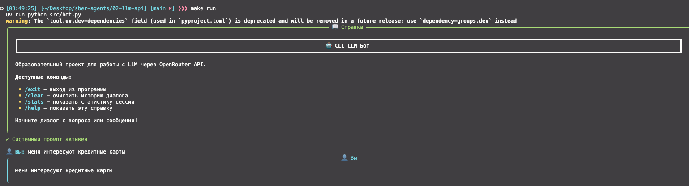

# 📑 Сводный отчет по заданию: **Простой CLI бот для работы с LLM через OpenRouter API.**
### 1. Настройка и запуск (Задание 1)
- ✅ Скриншот успешного запуска
  
- ✅ Пример простого диалога с метриками
  
### 2. Системные промпты (Задание 2)
- Текст системного промпта:
  
- Пример диалога (5-7 сообщений на скриншоте)
  
  
  
  
  
  
- Ваши наблюдения: следует ли бот инструкциям?
  #### 🤔 Мысли: Если говорить в целом - да, следует. Изначально я не запрещал боту отвечать на вопросы не связанные с его основным функционалом. Он мог сообщить информацию о погоде или о столице страны. Добавив это ограничение, бот отвечал только по теме. Это плюс, можно ограничить его рамками. Так же мне понравилось, что можно настроить структуру выводы ответа, подать тон общения и так далее. Но есть минусы: бот много придумывает от себя, но это можно поправить температурой. На самом деле, если бот под капотом не вызывает никаких функций или не использует RAG, он отлично справляется с задачей как собеседник. 
### 3. Сравнение моделей (Задание 3)
- Сравнивал openai/gpt-oss-20b:free, deepseek/deepseek-chat-v3.1:free, meta-llama/llama-3.3-8b-instruct:free
- От размера модели зависит скорость ответа. Самая быстрая оказалась llama-3.3-8b-instruct:free
- Качество ответов: лучший результат у openai/gpt-oss-20b:free, но в тестах не использовал температуру, модель придумывала ответы.
- Суммаризацию лучше сделала openai/gpt-oss-20b:free, deepseek/deepseek-chat-v3.1:free почему то не прислала ответ. Примеры приложены ниже
- Нужно протестировать и сравнить с гигачатом для общего понимания качества ответов.
### 4. Управление историей (Задание 4)
#### Описание реализованной стратегии: решил пойти через стратегию 2 (суммаризация). Считаю ее более правильной.
- Был создан ПРОМПТ для это задачи:
  
- Результат суммаризации:
  
  
- Фрагмент кода (key части)
  ```python
    def summarize_history(self) -> None:
        
        prompt = self.conversation_history.pop(0)
        last_message = self.conversation_history.pop(-1)
        self._extracted_from_summarize_history_5(prompt, last_message)


    def _extracted_from_summarize_history_5(self, prompt: dict, last_message: dict) -> None:
        self.conversation_history.insert(0, 
                                         { "role": "system",
                                           "content": SYSTEM_PROMPT_FOR_SUMMARIZE})
        response = self.client.chat.completions.create(
                model=self.model_name,
                messages=self.conversation_history,
            )
        assistant_message = response.choices[0].message.content
        self.conversation_history = [prompt]
        self.add_message("assistant", assistant_message)
        self.conversation_history.append(last_message) 
        console.print(Panel(
                Markdown(assistant_message),
                title="🤖 Ассистент - суммаризатор:",
                border_style="blue",
                padding=(1, 2)
            ))
    ```
