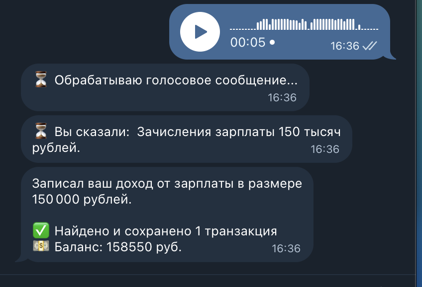
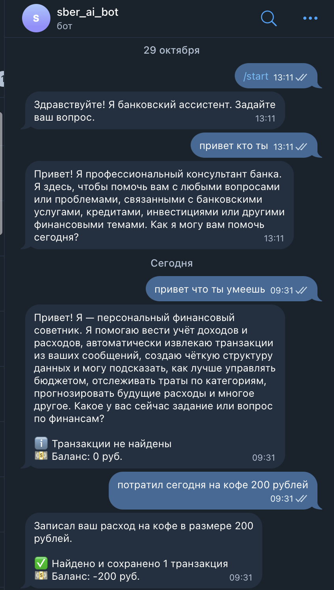
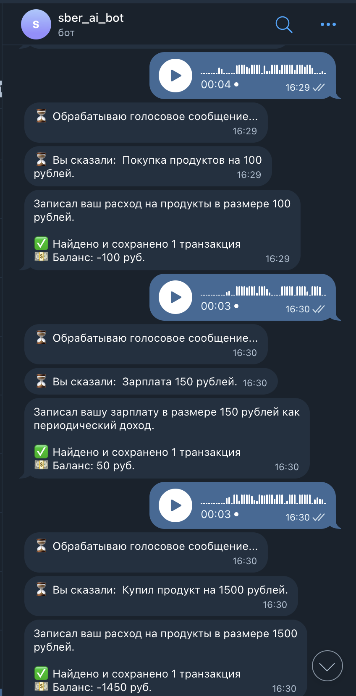

# Отчёт о выполнении задания

## Название проекта

**Персональный финансовый советник** — Telegram бот для учета доходов и расходов с интеграцией LLM через OpenRouter или Ollama.

### Краткое описание

Telegram-бот, который помогает пользователям вести учет финансовых транзакций. Бот автоматически извлекает информацию о доходах и расходах из текстовых сообщений, изображений чеков и голосовых сообщений, используя технологии LLM и Whisper. Поддерживает работу как с облачными моделями через OpenRouter, так и с локальными моделями через Ollama.

## Вариант задания

**Расширенный вариант**

Реализованы все базовые возможности плюс:
- Обработка голосовых сообщений через Whisper
- Поддержка локальных моделей через Ollama
- Обработка изображений (чеки, скриншоты)
- Мультимодальная обработка (текст, изображения, голос)

## Реализованные возможности

### Основной функционал

- [x] Извлечение транзакций из текстовых сообщений
- [x] Обработка изображений чеков и скриншотов (OCR через VLM)
- [x] Обработка голосовых сообщений (транскрипция через Whisper)
- [x] Автоматическая категоризация транзакций
- [x] Извлечение структурированных данных (дата, время, сумма, категория, описание)
- [x] Определение типа транзакции (доход/расход)
- [x] Определение частоты транзакции (повседневные, периодические, разовые)

### Отчёты и статистика

- [x] Команда `/balance` — отчет о балансе, доходах и расходах
- [x] Команда `/transactions` — список всех транзакций
- [x] Статистика по категориям
- [x] Расчёт общего баланса
- [x] Сортировка транзакций по дате

### Интеграции

- [x] Поддержка OpenRouter (облачные модели)
- [x] Поддержка Ollama (локальные модели)
- [x] Единый интерфейс для переключения между провайдерами
- [x] Structured output через JSON schema (Pydantic)
- [x] Поддержка vision-моделей для обработки изображений

### Технические возможности

- [x] Асинхронная обработка сообщений
- [x] Хранение истории диалогов в памяти
- [x] Хранение транзакций в памяти
- [x] Логирование операций
- [x] Обработка ошибок и исключений
- [x] Валидация данных через Pydantic
- [x] Конфигурация через переменные окружения

## Технологический стек

### Языки и инструменты

- **Python 3.11+** — основной язык разработки
- **uv** — менеджер зависимостей и виртуального окружения
- **Make** — автоматизация сборки и запуска

### Библиотеки и фреймворки

- **aiogram 3.x** — фреймворк для Telegram Bot API (polling)
- **openai 1.54+** — клиент для работы с LLM через OpenRouter/Ollama (единый интерфейс)
- **openai-whisper** — библиотека для транскрипции голосовых сообщений
- **ffmpeg-python** — библиотека для обработки аудио файлов (зависимость Whisper)
- **pydantic 2.0+** — валидация данных и structured output для LLM
- **python-dotenv** — для работы с переменными окружения

### Используемые модели

#### Текстовые модели

- **OpenRouter**: `openai/gpt-oss-20b:free`
- **Ollama**: `llama3.2`

#### Vision модели (для изображений)

- **OpenRouter**: `meta-llama/llama-3.2-11b-vision-instruct`
- **Ollama**: `llama3.2-vision`

#### Модели для транскрипции

- **Whisper**: `base` (для транскрипции голосовых сообщений на русском языке)

## Инструменты AI-driven разработки

### IDE и редакторы

- **Cursor** — AI-powered IDE с интеграцией LLM
- **Git** — система контроля версий

### LLM модели для разработки

- **Claude (Anthropic)** — через Cursor для написания кода, рефакторинга и отладки
- **GPT-4** — для решения сложных задач и генерации документации

### Использование AI в процессе разработки

- Генерация кода на основе технического задания
- Рефакторинг и оптимизация существующего кода
- Генерация документации и комментариев
- Отладка и решение проблем
- Написание тестов и примеров использования

## Скриншоты работы

### Обработка текстовых сообщений

### Обработка изображений

### Отчёт о балансе

## Облачный сервер

### Конфигурация

- **Локальная разработка**: macOS с Python 3.11+
- **Провайдер LLM (облачный)**: OpenRouter.ai
- **Провайдер LLM (локальный)**: Ollama (localhost:11434)

### Модели Ollama

Для локальной работы используются следующие модели Ollama:

- **llama3.2** — для обработки текстовых сообщений
  - Размер: ~2.0 GB
  - Поддержка structured output
  
- **llama3.2-vision** — для обработки изображений
  - Размер: ~4.7 GB
  - Поддержка vision и structured output

### Требования к инфраструктуре

- **CPU**: Достаточно для локальной разработки
- **RAM**: Минимум 8GB (рекомендуется 16GB для работы с Ollama)
- **Диск**: ~10GB для моделей Ollama и Whisper
- **GPU**: Опционально (ускоряет работу Ollama, но не обязательно)

### Деплой

Проект может быть развернут на:
- Локальном сервере с Ollama
- Облачном сервере (VPS) с Ollama
- Использование OpenRouter для работы без локальных моделей

## Основные вызовы и решения

### Вызов 1: Structured Output с опенсорсными моделями

**Проблема**: Необходимо было обеспечить структурированный вывод от LLM для извлечения транзакций. Многие опенсорсные модели не поддерживают native structured output.

**Решение**: 
- Использование JSON schema через `response_format` в OpenAI API
- Валидация через Pydantic модели
- Обработка ошибок парсинга с fallback значениями
- Использование `strict: True` для более точного соответствия схеме

### Вызов 2: Единый интерфейс для разных провайдеров

**Проблема**: Нужно было обеспечить возможность переключения между OpenRouter и Ollama без изменения кода.

**Решение**:
- Использование единого интерфейса через `AsyncOpenAI` клиент
- Настройка через переменные окружения (`OPENAI_BASE_URL`)
- Поддержка одинакового API для обоих провайдеров
- Конфигурация через `.env` файл

### Вызов 3: Обработка голосовых сообщений

**Проблема**: Требовалось добавить поддержку голосовых сообщений с транскрипцией на русском языке.

**Решение**:
- Интеграция OpenAI Whisper для транскрипции
- Загрузка модели при старте бота
- Использование модели "base" как баланс между качеством и размером
- Указание языка "ru" для улучшения точности
- Автоматическая очистка временных файлов после обработки

### Вызов 4: Обработка изображений через VLM

**Проблема**: Необходимо было обрабатывать изображения чеков и извлекать из них транзакции.

**Решение**:
- Использование vision-моделей (llama3.2-vision)
- Конвертация изображений в base64
- Передача изображений через vision API
- Комбинирование изображения и текстового промпта
- Использование structured output для извлечения данных

### Вызов 5: Хранение данных в памяти

**Проблема**: Требовалось хранить историю диалогов и транзакции без использования базы данных.

**Решение**:
- Использование словарей в памяти (`dict[int, list]`)
- Хранение по `chat_id` для изоляции пользователей
- Ограничение истории диалогов (последние 10 сообщений)
- Принятие ограничения потери данных при перезапуске

### Вызов 6: Обработка ошибок LLM API

**Проблема**: LLM может вернуть некорректный JSON или пустой ответ.

**Решение**:
- Многоуровневая обработка ошибок
- Проверка наличия обязательных полей
- Fallback значения для отсутствующих полей
- Детальное логирование для отладки
- Информативные сообщения об ошибках для пользователя

## Что узнал нового

### 1. Structured Output с опенсорсными моделями

Узнал, как использовать JSON schema через OpenAI-совместимый API для обеспечения структурированного вывода от опенсорсных моделей. Это позволяет использовать локальные модели Ollama с той же точностью, что и облачные модели.

### 2. Мультимодальная обработка данных

Познакомился с обработкой различных типов данных (текст, изображения, аудио) в одном приложении. Научился интегрировать Whisper для транскрипции и vision-модели для обработки изображений.

### 3. Единый интерфейс для разных провайдеров LLM

Понял, как создать единый интерфейс для работы с разными провайдерами LLM (OpenRouter и Ollama) через OpenAI-совместимый API. Это позволяет легко переключаться между облачными и локальными моделями.

### 4. Работа с Whisper для транскрипции

Изучил интеграцию OpenAI Whisper для транскрипции голосовых сообщений. Узнал о различных моделях Whisper, их размерах и качестве, а также о необходимости ffmpeg для обработки аудио.

### 5. Pydantic для валидации и structured output

Глубже изучил возможности Pydantic для валидации данных и генерации JSON schema для structured output. Это позволило создать надежную систему валидации ответов от LLM.

### 6. Асинхронная обработка в aiogram

Понял, как правильно работать с асинхронными операциями в aiogram, особенно при обработке файлов и вызовах внешних API. Научился управлять состоянием и обрабатывать ошибки в асинхронном контексте.

## Заключение

Проект успешно реализован с использованием современных технологий AI и разработки. Все поставленные задачи выполнены, бот готов к использованию. Проект демонстрирует возможности интеграции различных AI-моделей (LLM, VLM, Whisper) в единое приложение для решения практических задач.

---

**Дата завершения**: 2025-11-10  
**Версия**: 0.1.0  
**Лицензия**: MIT

